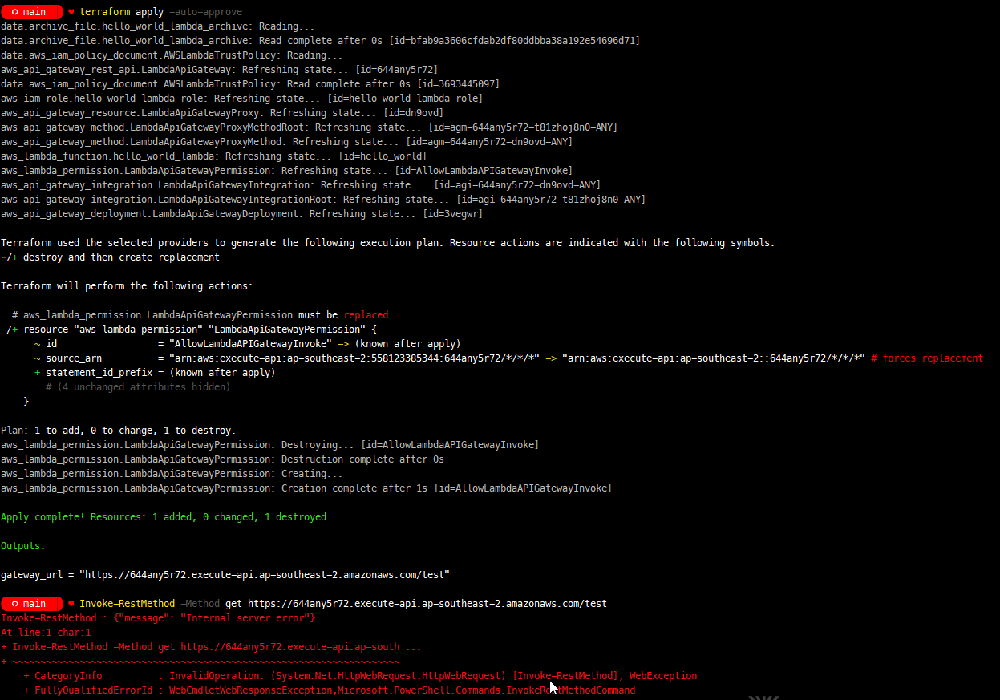
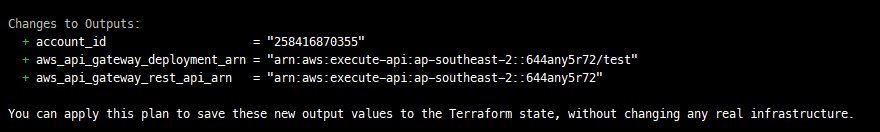
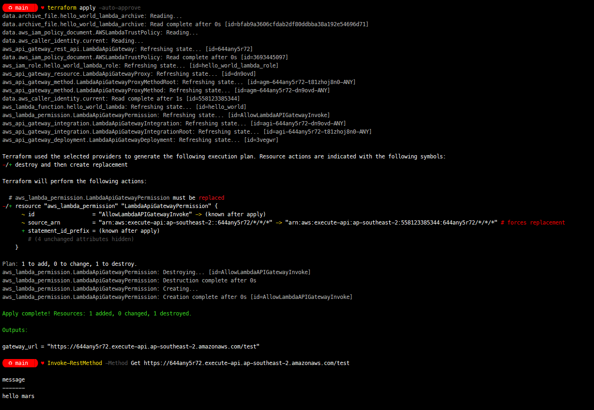
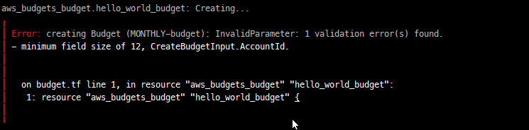
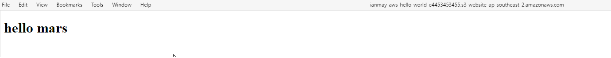
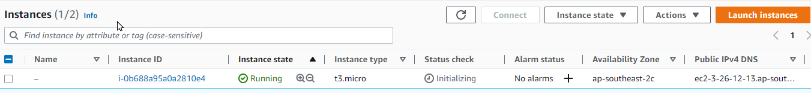
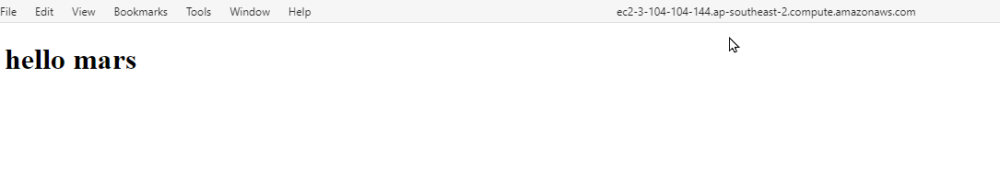
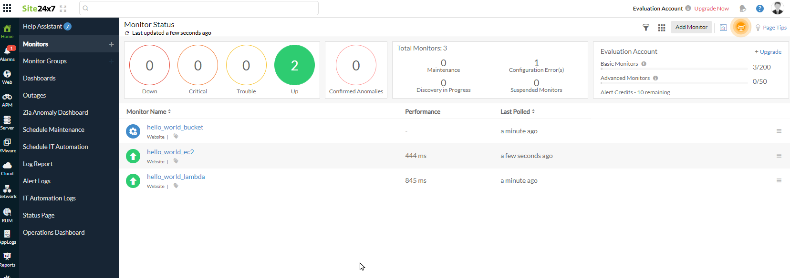

# aws_hello_world

This is a small AWS hello world example using terraform


# The Journey! 
```
The Goal
Using infrastructure as code, set up a hello world web server in AWS/Azure, and write a script for the server health check.

* Must achieve:

- You will need an AWS/Azure account for this task. You are expected to use free-tier only.

- You can use any infrastructure as code tool you like.

- The code must be able to run anywhere.

- Provide a script to run health checks periodically and externally.

- Provide documents of the code.

- Automate as much as possible. 

- The code must be stored in a source control tool of your choice and a link must be provided 
```

This is my first time using both AWS and Terraform, so there will be lots of learning for me on the way. Heres what I'm hoping to create:

* a serverless function (lambda) to return hello world via a gateway api
* a s3 bucket hosting a static hello world page
* a ec2 instance running linux serving a static hello world page

to monitor it all: 
* a powershell or bash script that can be used to adhoc check the sites are up
* use site24x7 to monitor that the sites are up

I would like to create something like prometheus , cloudwatch or simular to monitor but I dont think time will allow. 

I'd also really like to extend this too for personal learning later on. I thought it would be cool if the lambda could grab a live image of the earth or mars, save this to a bucket and the EC2 would serve a static page referencing the image. This way there's an API to hit to update a picture for our hello world app. 

## Getting Started ~ Setup

Time to get set up and install all the relevant tools I will need to complete the work. I'm using a windows based machine and am a fan of Chocolatey so that's what I'll use to install the tools. A list of links to the websites is also included below in case you prefer to get the installers directly from there. 

### from powershell :
```PowerShell
# Install awscli and terraform. Needed to access and provision resources in AWS
choco install awscli
choco install terraform

# Install python - I want to try and create a simple lambda function and will use python
choco install python3

# Install sam and docker. AWS Serverless Application Model or SAM allows us to test functions locally which will help save on the cost and time of deploying. Docker is a requirement for aws sam. While it worked fine for me installing Docker with Chocolatey, you might be saver downloading the MSI and installing it directly from their website.  
choco install awssamcli
choco install docker

# Post install let's refresh the session environment (allows any new changes to path, etc from the installs to be picked up inside this PowerShell session)
refreshenv

# Post-install let's check the versions (mostly to make sure we can execute the tools before we start)
aws.exe --version
terraform --version
python.exe --version
sam --version
docker --version

```
### via msi's:
Tools can be downloaded and installed from MSI's directly from the manufactures website 
* AwsCli : https://aws.amazon.com/cli/
* Terraform : https://developer.hashicorp.com/terraform/downloads
* Python : https://www.python.org/downloads/
* AWS Serverless Application Model : https://docs.aws.amazon.com/serverless-application-model/latest/developerguide/install-sam-cli.html
* Docker : https://www.docker.com


## Getting Started ~ Set up AWS account information. 
After creating a free account in AWS, adding multifactor etc I used the AWS web console to create a new user and group for this example. Then created an access key for the user. You'll need to take a copy of the details. 

You can run the awscli tool to set up credentials allowing you to work with aws. You just follow the simple prompts. I choose `ap-southeast-2` for the region and added my access key and access secret from the new user I created in the web console. It's worth noting that awscli stores these details in plain text on disk after setup. 

```
# set up aws with account info
aws configure

# plain text credintials ! 
cat ~\.aws\config
cat ~\.aws\credentials 
```

## Getting Started ~ Set up a working directory. 
Next is to create a directory to hold all the work. 
```
# create a folder to hold the project
mkdir aws_hello_world
cd .\aws_hello_world\
```

## Step 1 ~ Hello world lambda and api gateway
Everyone had been telling me about serverless functions. Its been one of the things I really wanted to try out for a while.  

### Bootstraping a simple python hello world function with AWS Serverless Application Model
The "AWS Serverless Application Model" or SAM is pretty neat. It can be used to provide boilerplate code examples, and better, allow you to test them locally before pushing it up into AWS. 

To set up a boilerplate python app you just need to run `sam init`


I did run into a problem where it failed cloning at first. Turned out that as I was on Windows I needed to set `LongPathsEnabled` in the registry for windows first. You can check it via regedit under `HKEY_LOCAL_MACHINE\SYSTEM\CurrentControlSet\Control\FileSystem` or in PowerShell, example below. After that re-running sam init worked fine.

```Powershell
# check LongPathsEnabled (should be 1 for enabled)
Get-ItemProperty -Path "HKLM:\SYSTEM\CurrentControlSet\Control\FileSystem" -Name "LongPathsEnabled"

# you can set it if needed
Set-ItemProperty -Path "HKLM:\SYSTEM\CurrentControlSet\Control\FileSystem" -Name "LongPathsEnabled" -Value 1
```
After this, I had a boilerplate py app that we can run up locally. You just need to drop into the new `hello_world` folder and run SAM with start-api. After that, you can test it quickly in a browser by going to `http://127.0.0.1:3000/hello`

```Powershell
cd .\hello_world\ 
sam local start-api
```


Another cool thing was you can edit the code with SAM running and then just refresh to see the changes! I opened up `.\hello_world\hello_world\app.py` and changed the line of the message from "hello world" to "hello mars"

```python
# From .\hello_world\hello_world\app.py
# ...
    return {
        "statusCode": 200,
        "body": json.dumps({
            "message": "hello mars",
            # "location": ip.text.replace("\n", "")
        }),
    }
# ...
```


If we were writing something more complicated I think that's pretty cool that we can use sam to make sure it's going to work first before spending time and cost on a deployment to AWS!

### Terraform Mars!

Now we have something simple, I wanted to try out creating a lambda in AWS. The first thing I did was create a new tf file. Back in the root folder, I created a `main.tf`. 

Next is to let terraform know we want to work with AWS and so we add in the provider. We can also specify a version we want to enforce for Terraform. Let's do that : 

```terraform
# ./versions.tf
terraform {
  required_version = ">= 0.13.1"

  required_providers {
    aws = {
      source  = "hashicorp/aws"
      version = ">= 3.19"
    }
  }
}
```
On to configuring our provider (AWS). The main thing will be to tell AWS which region to use. For this example, I went with `ap-southeast-2` which is Sydney. There are a few other settings that speed up the calls from Terraform too, so let's include those. 

```terraform
provider "aws" {
  region = "ap-southeast-2"
  # this makes things faster!
  skip_get_ec2_platforms      = true
  skip_metadata_api_check     = true
  skip_region_validation      = true
  skip_credentials_validation = true
  skip_requesting_account_id  = true
}
```

Our Lambda will need some roles and permissions. I've seen a few different ways of doing this, mainly just feeding JSON from a string into the IAM role. However, Terraform has an `aws_iam_policy_document` data source which can be defined. I liked the readability of this approach.

```terraform
# create a policy to be used by the role for our lambda
data "aws_iam_policy_document" "AWSLambdaTrustPolicy" {
  statement {
    actions    = ["sts:AssumeRole"]
    effect     = "Allow"
    principals {
      type        = "Service"
      identifiers = ["lambda.amazonaws.com"]
    }
  }
}

# create the for the lambda
resource "aws_iam_role" "hello_world_lambda_role" {
  name               = "hello_world_lambda_role"
  assume_role_policy = "${data.aws_iam_policy_document.AWSLambdaTrustPolicy.json}"
}
```

We also need to get the python code up into AWS. The preferred approach is a zip file. After that, we can define our Lambda.

```terraform
# create an archive of the hello world code to deploy
data "archive_file" "hello_world_lambda_archive" {
  type        = "zip"
  source_file = "./hello_world/hello_world/app.py"
  output_path = "hello_world.zip"
}

# create the lambda from the archive file
resource "aws_lambda_function" "hello_world_lambda" {
  function_name    = "hello_world"
  runtime          = "python3.9"
  handler          = "main.lambda_handler"
  filename         = "${data.archive_file.hello_world_lambda_archive.output_path}"
  source_code_hash = "${data.archive_file.hello_world_lambda_archive.output_base64sha256}"
  role               = "${aws_iam_role.hello_world_lambda_role.arn}"
}
```

This should be everything we need for now. Run `terraform init`. This will set up the providers and versions. Once complete we can run `terraform plan` to see if we have any errors, and if not it will show the changes it wants to make.


Success! But I think we can do better. In a real-world setting, I'd imagine that the code base is likely to grow and become more complex. So to improve the code - let's:

* split out the code into separate files. This will help make it easier to maintain. 
* Let's add variables to abstract away all those hard-coded references making the code a little more reusable. 

I start with removing the versions from the top of a file into one called `versions.tf`

```terraform
terraform {
  required_version = ">= 0.13.1"

  required_providers {
    aws = {
      source  = "hashicorp/aws"
      version = ">= 3.19"
    }
  }
}
```

After that, I created a new file to hold all the variables called `variables.tf`. The first obvious thing to include is the region. I also read that we can include objects as variables. So I thought it would be nice to try this out. I've created one to hold details from our hello world app.

```terraform
# basic variable!
variable "aws_region" {
 type        = string
 default     = "ap-southeast-2"
}

# you can create objects too! 
variable "hello_world_app" {
 type = object({
    name       = string
    local_path = string
    handler    = string
    runtime    = string
  })
  default = {
    name       = "hello_world"
    local_path = "./hello_world/hello_world/app.py"
    handler    = "main.lambda_handler"
    runtime    = "python3.9"
  }
}
 
```
With these in place, we can rework the `main.tf` and remove all the hard coded references. Here's the diff: 


Again. Post changes, we run a `terraform plan` to ensure I haven't introduced any errors and that it's still ok to create the resources. This worked. And for fun, I ran `terraform apply`, logged into AWS, and confirmed we could see the Lambda!


#### API Gateway
So far - all great, but it's not publicly accessible yet. Need to fix that. Starting with creating a gateway API container to hold all other API objects. 
```terraform
resource "aws_api_gateway_rest_api" "LambdaApiGateway" {
  name        = "LambdaApiGateway"
}
```
Now we have that in place we need to add some resources to handle all incoming requests. Between the {proxy+} under path_part and "ANY" for the http_method, we should catch all incoming requests. 

```terraform
resource "aws_api_gateway_resource" "LambdaApiGatewayProxy" {
   rest_api_id = aws_api_gateway_rest_api.LambdaApiGateway.id
   parent_id   = aws_api_gateway_rest_api.LambdaApiGateway.root_resource_id
   path_part   = "{proxy+}"
}

resource "aws_api_gateway_method" "LambdaApiGatewayProxyMethod" {
   rest_api_id   = aws_api_gateway_rest_api.LambdaApiGateway.id
   resource_id   = aws_api_gateway_resource.LambdaApiGatewayProxy.id
   http_method   = "ANY"
   authorization = "NONE"
}
```

Well nearly - the proxy still won't match an empty path at the API's root. To fix that let's add another one for the root by changing the resource_id to look at the root_resource_id.

```terraform
resource "aws_api_gateway_method" "LambdaApiGatewayProxyMethodRoot" {
   rest_api_id   = aws_api_gateway_rest_api.LambdaApiGateway.id
   resource_id   = aws_api_gateway_rest_api.LambdaApiGateway.root_resource_id
   http_method   = "ANY"
   authorization = "NONE"
}
```

Great - now we need to route the requests off to our lambda using an aws_api_gateway_integration. We need an integration for the APIs root too.

```terraform
resource "aws_api_gateway_integration" "LambdaApiGatewayIntegration" {
   rest_api_id             = aws_api_gateway_rest_api.LambdaApiGateway.id
   resource_id             = aws_api_gateway_method.LambdaApiGatewayProxyMethod.resource_id
   http_method             = aws_api_gateway_method.LambdaApiGatewayProxyMethod.http_method
   integration_http_method = "POST"
   type                    = "AWS_PROXY"
   uri                     = aws_lambda_function.hello_world_lambda.invoke_arn
}

resource "aws_api_gateway_integration" "LambdaApiGatewayIntegrationRoot" {
   rest_api_id             = aws_api_gateway_rest_api.LambdaApiGateway.id
   resource_id             = aws_api_gateway_method.LambdaApiGatewayProxyMethodRoot.resource_id
   http_method             = aws_api_gateway_method.LambdaApiGatewayProxyMethodRoot.http_method
   integration_http_method = "POST"
   type                    = "AWS_PROXY"
   uri                     = aws_lambda_function.hello_world_lambda.invoke_arn
}
```
The Lambda isn't going to let the API invoke it by default though! Let's fix that by adding the relavent permissions

```terraform
resource "aws_lambda_permission" "LambdaApiGatewayPermission" {
   statement_id  = "AllowLambdaAPIGatewayInvoke"
   action        = "lambda:InvokeFunction"
   function_name = aws_lambda_function.hello_world_lambda.function_name
   principal     = "apigateway.amazonaws.com"
   source_arn    = "${aws_api_gateway_rest_api.LambdaApiGateway.execution_arn}/*/*/*"
}
```

The last thing is to set up a deployment using stages to expose the API and config at a URL for testing. Let's be boring and call the stage "test". For a little flare, we will however add it into our `variables.tf` file so life isn't too bad.

```terraform
# in variables.tf
variable "api_deployment_stage_name" {
 type        = string
 default     = "test"
}

# back in main.tf
resource "aws_api_gateway_deployment" "LambdaApiGatewayDeployment" {
   depends_on = [
     aws_api_gateway_integration.LambdaApiGatewayIntegration,
     aws_api_gateway_integration.LambdaApiGatewayIntegrationRoot,
   ]
   rest_api_id = aws_api_gateway_rest_api.LambdaApiGateway.id
   stage_name  = var.api_deployment_stage_name
}
```

Epic! Let's apply it and see what we get!



Not so epic! 

#### Lights are on but no ones home !

After a little troubleshooting and using the AWS console to test the gateway. It looks like the permissions in the lambda wasn't set correctly. After poking around a bit, I found that adding the account number id to the arn of the aws_api_gateway_rest_api in the lambdas permissions allowed it to work. Adding the following lines helped to troubleshoot what was being used (and what wasn't)
```terrafrom
data "aws_caller_identity" "current" {}

output "account_id" {
  value = data.aws_caller_identity.current.account_id
}

output "aws_api_gateway_rest_api_arn" { 
  value = aws_api_gateway_rest_api.LambdaApiGateway.execution_arn
}

output "aws_api_gateway_deployment_arn" { 
  value = aws_api_gateway_deployment.LambdaApiGatewayDeployment.execution_arn
}
```
Here, using `terraform plan` we can see that the account id is missing between the 2 colons 



I want to understand why this is happening, but for now - building up the arn seems to work.  

```terraform
...
source_arn = "arn:aws:execute-api:${var.aws_region}:${data.aws_caller_identity.current.account_id}:${aws_api_gateway_rest_api.LambdaApiGateway.id}/*/*/*"
```

As soon as I have more time I'm going to come back to this. But for now, at least it's working.



## Learning from Bargain Basement Budgets! 
Before I get carried away. Let's set up a quick budget. After all, it's my card on the line :P 

I've created the following file `budget.tf`. Here I'll define a budget and notification. 

I created the following variables.

```terraform
# variables to hold our budget details
variable "budget" {
 type = object({
    amount     = string
    email      = list(string)
    time_span  = string
  })
  default = {
    amount     = "10"
    email      = ["not@really.real"]
    time_span  = "MONTHLY"
  }
}
```
then a new file called `budget.tf` that contained:

```terraform
resource "aws_budgets_budget" "hello_world_budget" {
  name              = "hello_world_${var.budget.time_span}-budget"
  budget_type       = "COST"
  limit_amount      = var.budget.amount
  limit_unit        = "USD"
  time_unit         = var.budget.time_span
  notification {
    comparison_operator        = "GREATER_THAN"
    threshold                  = 100
    threshold_type             = "PERCENTAGE"
    notification_type          = "FORECASTED"
    subscriber_email_addresses = var.budget.email
  }
}
```
With this in place, time for another surprise! The account_id problem reared its head again! From the error, it looks like the account_id is less than 12 chars. Lol - I bet its empty as was the case for the LambdaApiGatewayDeployment arn


This was very helpful as now I know its something with my setup more globally rather than just that one bit. Going back to the beginning when I declared the provider, I'd taken some code that I saw should speed up interacting with terraform - the culprit? skip_requesting_account_id is false! Doh!

A quick change to this let me use the LambdaApiGatewayDeployment arn again:

```terraform
provider "aws" {
...
  skip_requesting_account_id  = false
...
}
...
resource "aws_lambda_permission" "LambdaApiGatewayPermission" {
...
   source_arn    = "${aws_api_gateway_rest_api.LambdaApiGateway.execution_arn}/*/*/*"
...
}
```

I also now have a Budget! 

### Cleaning up
Now the Lambda is working, I'd like to move it all into its own file and then move on to other approaches for for hello world. To do this I moved the code after declairing the provider into a new file called `hello_world_lamdba.tf`. I choose not to split out the gateway (although that might be a valid approach). The idea here was I wanted, for my own sake to group together all the resources for a single objective into their own files. So as the gateway is currently only serving the lambda, I'll keep them together. After this, a quick terraform apply to make sure it's all still working. 


### References and helpful links have been
standing on the shoulders of giants, the following have been very helpful while working on creating the lambda:
* https://registry.terraform.io/providers/hashicorp/aws/2.34.0/docs/guides/serverless-with-aws-lambda-and-api-gateway
* https://registry.terraform.io/modules/mineiros-io/lambda-function/aws/latest/examples/python-function
* https://advancedweb.hu/how-to-define-lambda-code-with-terraform/
* https://hevodata.com/learn/terraform-lambda/
* https://www.maxivanov.io/deploy-aws-lambda-to-vpc-with-terraform/
* https://www.middlewareinventory.com/blog/aws-lambda-terraform/
* https://levelup.gitconnected.com/deploy-lambda-function-and-api-gateway-using-terraform-d12cdc50dee8

## Step 2 ~ Bucket hosted Hello World
In contrast, this next task was much easier. Amazon allows you to host a static website in S3 so why not!
I created a static page by outputting the following:
`echo '<!doctype html> <html> <body> <h1>hello mars</h1> </body> </html>' >  .\hello_world_static\index.html`

Then I set up another object in `variables.tf`

```terraform
variable "hello_world_bucket" {
 type = object({
    path       = string
    domain     = string
  })
  default = {
    path       = "./hello_world_static/index.html"
    domain     = "ianmay-aws-hello-world"
  }
}
```

And finally, in a new file called `hello_world_bucket.tf` I added the following. 

```terraform
# set up a bucket to hold our static webpage
resource "aws_s3_bucket" "hello_world_bucket" {
  bucket = var.hello_world_bucket.domain
  acl = "public-read"
}

# upload the static webpage to the bucket
# we can also set the content_type here so that the page will load in a browser. 
resource "aws_s3_bucket_object" "hello_world_bucket_file" {
  bucket = aws_s3_bucket.hello_world_bucket.id
  key    = "index.html"
  source = var.hello_world_bucket.path
  content_type = "text/html"
  etag = filemd5(var.hello_world_bucket.path)
}

# allow S3 to host a static website
resource "aws_s3_bucket_website_configuration" "hello_world_bucket_configuration" {
  bucket = aws_s3_bucket.hello_world_bucket.id
  index_document {
    suffix = "index.html"
  }
  error_document {
    key = "index.html"
  }
}

# return the url for our bucket
output "hello_world_bucket_url" {
  value = aws_s3_bucket.hello_world_bucket.website_endpoint
}
``` 

There's not too much to talk about here, but some key points are 
* `etag = filemd5()` : is used to let terraform know to update the bucket when index.html changes
* `content_type` : is used to allow the page to be viewed in a browser rather than ask you to download it
* `aws_s3_bucket_website_configuration` : is used to host the static page
* `domain` : just to prepend a label on the url
and the result:


### References and helpful links have been
 * https://docs.aws.amazon.com/AmazonS3/latest/userguide/WebsiteHosting.html
* https://registry.terraform.io/providers/hashicorp/aws/latest/docs/resources/s3_bucket_website_configuration
* https://awstip.com/how-to-setup-static-web-hosting-using-s3-and-cloudfront-through-terraform-392a6e1dd29d
* https://www.tangramvision.com/blog/abusing-terraform-to-upload-static-websites-to-s3

## Step 3 ~ EC2 hosted Hello World
Again, this one was straightforward. I think i got a lot of the learning done with the lambda which made this easier. So what's going on below? First, we create a security group to allow inbound and outbound traffic. I could add more like ssh here, but for this example 80 and 443 should work. 

In the aws_instance block, we can use `user_data` to bootstrap or provision the box. The uses are endless. I'd love to come back to this and use something like curl to pull the static website from a bucket for fun. For now, I'm just going to update the system, create a static page, install httpd, and then start the service. As a side note - I was blown away by how quickly it was provisioned! 

```terraform
# create a security group to allow inbound and outbound traffic
resource "aws_security_group" "hello_world_ec2_security_group" {
    name = "hello_world_ec2_security_group"
    # allow inbound on 80 (http)
    ingress {
      cidr_blocks = ["0.0.0.0/0"]
      from_port = 80
      protocol = "tcp"
      to_port = 80
    }
    # allow inbound on 443 (https)
    ingress {
      cidr_blocks = ["0.0.0.0/0"]
      from_port = 443
      protocol = "tcp"
      to_port = 443
    }
    # allow outbound everything for now
    egress {
      cidr_blocks = ["0.0.0.0/0"]
      from_port = 0
      protocol = "-1"
      to_port = 0
    }
    # i could add ssh here if i intended to interact with the box
}

# create the instance
resource "aws_instance" "hello_world_ec2_instance" {
    ami = "ami-06bb074d1e196d0d4" # Amazon Linux 2 AMI
    instance_type = "t3.micro"
    vpc_security_group_ids = [aws_security_group.hello_world_ec2_security_group.id]
    user_data = <<EOF
#!/bin/bash
yum -y update
yum -y install httpd
# be nice to curl a file from the bucket at this point, but for now....
echo "<!doctype html><html><body><h1>hello mars</h1></body></html>" > /var/www/html/index.html
service httpd start
chkconfig httpd on
EOF
  tags = { 
      name = "hello_world_ec2_instance"
  }
}

# return the url for our instance
output "hello_world_instance_url" {
  value = aws_instance.hello_world_ec2_instance.public_dns
}
```



## Script to make sure the pages are all up!
* todo - see if I can capture terrform output and then (curl / invoke-webrequest / invoke-restmethod)
* todo - look into site24/7

## Monitoring with Site 24x7
To make sure we are monitoring the sites (lambda, bucket, and EC2 instance) externally, I went with setting up simple website monitors in site24x7. Terraform has a provider for this which was nice to see! 

The biggest challenge, it turned out, was setting up oAuth2 to let terraform and site24x7 talk to each other. I used a Zoho account (https://api-console.zoho.com if you want to try). In Zoho I set up a simple "Self Client". Copied the `Client Secret` and `Client Id` and then generated a code with a scope of `Site24x7.account.All,Site24x7.admin.All,Site24x7.reports.All,Site24x7.operations.All,Site24x7.msp.All,Site24x7.bu.All`. Then set a time duration of 10 minutes. 

Then we request the refresh and access tokens for the terraform provider using curl or postman

```bash
curl.exe https://accounts.zoho.com/oauth/v2/token -X POST -d "client_id=1000.XXXXX" -d "client_secret=XXXXX" -d "code=1000.XXXXX.XXXXXX" -d "grant_type=authorization_code" --insecure
```

this returns the following message
```
{"access_token":"1000.XXXXX.XXXXX","refresh_token":"1000.XXXXX.XXXXX","api_domain":"https://www.zohoapis.com","token_type":"Bearer","expires_in":3600}
```

So let's add to our `variables.tf` file
```terraform
# variables to hold our site 24x7 monitoring details
variable "monitoring"{ 
 type = object({
    check_frequency        = string
    location_profile_name  = string
    oauth2_client_id       = string
    oauth2_client_secret   = string
    oauth2_refresh_token   = string
    oauth2_access_token    = string

  })
  default = {
    check_frequency        = "5"
    location_profile_name  = "North America"
    oauth2_client_id       = "1000.XXXXX"
    oauth2_client_secret   = "XXXXX"
    oauth2_refresh_token   = "1000.XXXXX.XXXXX"
    oauth2_access_token    = "1000.XXXXX.XXXXX"
    
  }
}
```

and then for the setting up site24x7 I created a new file called `monitoring.tf`
```terraform
provider "site24x7" {
  oauth2_client_id      = var. monitoring.oauth2_client_id
  oauth2_client_secret  = var.monitoring.oauth2_client_secret
  oauth2_refresh_token  = var.monitoring.oauth2_refresh_token
  oauth2_access_token   = var.monitoring.oauth2_access_token
  data_center = "US"
  retry_min_wait = 1
  retry_max_wait = 30
  max_retries = 4
}

resource "site24x7_threshold_profile" "website_threshold_profile_us" {
  profile_name = "URL Threshold Profile - Terraform"
  type = "URL"

  website_content_changes {
    severity     = 3
    value = 95
  }

  primary_response_time_critical_threshold = {
    severity = 3
    comparison_operator = 1
    value               = 2000
    strategy            = 2
    polls_check         = 5
  }

  secondary_response_time_trouble_threshold = {
    severity = 2
    comparison_operator = 1
    value               = 3000
    strategy            = 2
    polls_check         = 5
  }

  secondary_response_time_critical_threshold = {
    severity = 3
    comparison_operator = 1
    value               = 4000
    strategy            = 2
    polls_check         = 5
  }
}

resource "site24x7_website_monitor" "hello_world_lambda" {
  depends_on = [
     aws_api_gateway_deployment.LambdaApiGatewayDeployment,
     site24x7_threshold_profile.website_threshold_profile_us
  ]
  display_name = "hello_world_lambda"
  website = aws_api_gateway_deployment.LambdaApiGatewayDeployment.invoke_url
  check_frequency = var.monitoring.check_frequency
  location_profile_name = "North America"
}

resource "site24x7_website_monitor" "hello_world_bucket" {
  depends_on = [
     aws_s3_bucket.hello_world_bucket,
     site24x7_threshold_profile.website_threshold_profile_us
  ]  
  display_name = "hello_world_bucket"
  website = "http://${aws_s3_bucket.hello_world_bucket.website_endpoint}"
  check_frequency = var.monitoring.check_frequency
  location_profile_name = "North America"
}

resource "site24x7_website_monitor" "hello_world_ec2" {
  depends_on = [
     aws_s3_bucket.hello_world_bucket,
     aws_instance.hello_world_ec2_instance
  ]   
  display_name = "hello_world_ec2"
  website = "http://${aws_instance.hello_world_ec2_instance.public_dns}"
  check_frequency = var.monitoring.check_frequency
  location_profile_name = var.monitoring.location_profile_name
}
```
terraform plan ; terraform apply and voila! 



Now we have site24x7 set up to watch the lambda, bucket and ic2 instance!

* https://www.site24x7.com/help/api/#authentication
* https://www.site24x7.com/help/api/#authentication
* https://github.com/site24x7/terraform-provider-site24x7

## Whats Next (If i had more time)
* scripting something to quickly store oAuth creds in environment variables would have been nice and do-able
* using a tfvars file and or environment variables


# other references that have been helpful

* https://developer.hashicorp.com/terraform/language/values/variables
* https://docs.aws.amazon.com/serverless-application-model/latest/developerguide/what-is-sam.html


* https://www.site24x7.com
* https://www.site24x7.com/help/admin/developer/terraform.html
* https://registry.terraform.io/providers/site24x7/site24x7/latest/docs