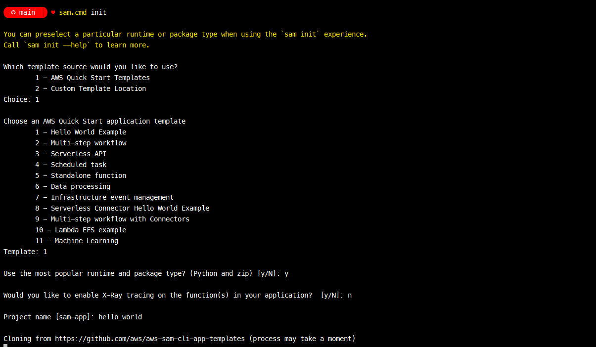

# aws_hello_world

This is a small aws hello world example using terraform


# The Journey! 
```
The Goal
Using infrastructure as code, set up a hello world web server in AWS/Azure, and write a script for the server health check.

* Must achieve:

- You will need an AWS/Azure account for this task. You are expected to use free-tier only.

- You can use any infrastructure as code tool you like.

- The code must be able to run anywhere.

- Provide a script to run health checks periodically and externally.

- Provide documents of the code.

- Automate as much as possible. 

- The code must be stored in a source control tool of your choice and a link must be provided 
```

## Getting Started ~ Setup

Time to get set up and install all the relevant tools I will need to complete the work. I'm using a windows based machineand am a fan of Chocolatey so that's  what I'll use to install the tools. A list of links to the websites is also included below in case you prefer to get the installers directly from there. 

### from powershell :
```PowerShell
# Install awscli and terraform. Needed to access and provision resources in AWS
choco install awscli
choco install terraform

# Install python - I want to try and create a simple lambda function and will use python
choco install python3

# Install sam and docker. AWS Serverless Application Model or SAM allows us to test functions locally which will help save on the cost and time of deploying. Docker is a requirement for aws sam. While it worked fine for me installing Docker with Chocolatey, you might be saver downloading the MSI and installing it directly from their website.  
choco install awssamcli
choco install docker

# Post install let's refresh session environment (allows any new changes to path, etc from the installs to be picked up inside this powershell session)
refreshenv

# Post install let's check the versions (mostly to make sure we can execute the tools before we start)
aws.exe --version
terraform --version
python.exe --version
sam --version
docker --version

```
### via msi's:
Tools can be downloaded and installed from msi's directly from the manufactures website 
* AwsCli : https://aws.amazon.com/cli/
* Terraform : https://developer.hashicorp.com/terraform/downloads
* Python : https://www.python.org/downloads/
* AWS Serverless Application Model : https://docs.aws.amazon.com/serverless-application-model/latest/developerguide/install-sam-cli.html
* Docker : https://www.docker.com


## Getting Started ~ Set up AWS account information. 
After creating a free account in AWS, adding multifactor etc I used the AWS web console to create a new user and group for this example. Then created an access key for the user. You'll need to take a copy of the details. 

You can run the awscli tool to set up credentials allowing you to work with aws. You just follow the simple prompts. I choose `ap-southeast-2` for the region and added my access key and access secret from the new user I created in the web console. It's worth noting that awscli stores these details in plain text on disk after setup. 

```
# set up aws with account info
aws configure

# look ma! plain text credintials ! 
cat ~\.aws\config
cat ~\.aws\credentials 
```

## Getting Started ~ Set up a working directory. 
Next is to create a directory to hold all the work. 
```
# create a folder to hold the project
mkdir aws_hello_world
cd .\aws_hello_world\
```
## Bootstraping a simple python hello world function with AWS Serverless Application Model
The "AWS Serverless Application Model" or SAM is pretty neat. It can be used to provide boiler plate code examples, and better, allow you to test them locally before pushing it up into aws. 

To set up a boiler plate python app you just need to run `sam init`



I did run into a problem where it failed cloning at first. Turned out that as I was on Windows I needed to set `LongPathsEnabled` in the registry for windows first. You can check it via regedit under `HKEY_LOCAL_MACHINE\SYSTEM\CurrentControlSet\Control\FileSystem` or in powershell, example below. After that re-running sam init worked fine.

```Powershell
# check LongPathsEnabled (should be 1 for enabled)
Get-ItemProperty -Path "HKLM:\SYSTEM\CurrentControlSet\Control\FileSystem" -Name "LongPathsEnabled"

# you can set it if needed
Set-ItemProperty -Path "HKLM:\SYSTEM\CurrentControlSet\Control\FileSystem" -Name "LongPathsEnabled" -Value 1
```
After this, I had a boilerplate py app that we can run up locally. You just need to drop into the new `hello_world` folder and run SAM with start-api. After that you can test it quickly in a browser by going to `http://127.0.0.1:3000/hello`

```Powershell
cd .\hello_world\ 
sam local start-api
```


Another cool thing was you can edit the code with SAM running and then just refresh to see the changes! I opened up `.\hello_world\hello_world\app.py` and changed the line of the message from "hello world" to "hello mars"

```python
# From .\hello_world\hello_world\app.py
# ...
    return {
        "statusCode": 200,
        "body": json.dumps({
            "message": "hello mars",
            # "location": ip.text.replace("\n", "")
        }),
    }
# ...
```


If we were writing something more complicated I think that's pretty cool that we can use sam to make sure its going to work first before spending time and cost on a deployment to aws!

## Terraform Mars!

Now we have something simple, I really wanted to try out creating a lambda in AWS. The first thing I did was create a new tf file. Back in the root folder I created a `main.tf`. 

Next is to let terraform know we want to work with AWS and so we add in the provider. We can also specify a version we want to enforce for Terraform. Let's do that : 

```terraform
# ./versions.tf
terraform {
  required_version = ">= 0.13.1"

  required_providers {
    aws = {
      source  = "hashicorp/aws"
      version = ">= 3.19"
    }
  }
}
```
On to configuring our provider (AWS). The main thing will be to tell AWS which region to use. For this example, I went with `ap-southeast-2` which is Sydney. There's a few other settings that speed up the calls from Terraform too, so let's include those. 

```terraform
provider "aws" {
  region = "ap-southeast-2"
  # this makes things faster!
  skip_get_ec2_platforms      = true
  skip_metadata_api_check     = true
  skip_region_validation      = true
  skip_credentials_validation = true
  skip_requesting_account_id  = true
}
```

Our Lambda will need some roles and permissions. I've seen a few different ways of doing this, mostly just feeding JSON from a string into the IAM role. However, Terraform has an `aws_iam_policy_document` data source which can be defined. I liked the readability of this approach.

```terraform
# create a policy to be used by the role for our lambda
data "aws_iam_policy_document" "AWSLambdaTrustPolicy" {
  statement {
    actions    = ["sts:AssumeRole"]
    effect     = "Allow"
    principals {
      type        = "Service"
      identifiers = ["lambda.amazonaws.com"]
    }
  }
}

# create the for the lambda
resource "aws_iam_role" "hello_world_lambda_role" {
  name               = "hello_world_lambda_role"
  assume_role_policy = "${data.aws_iam_policy_document.AWSLambdaTrustPolicy.json}"
}
```

We also need to get the python code up into AWS. The preferred approach is a zip file. After that, we can define our Lambda.

```terraform
# create an archive of the hello world code to deploy
data "archive_file" "hello_world_lambda_archive" {
  type        = "zip"
  source_file = "./hello_world/hello_world/app.py"
  output_path = "hello_world.zip"
}

# create the lambda from the archive file
resource "aws_lambda_function" "hello_world_lambda" {
  function_name    = "hello_world"
  runtime          = "python3.9"
  handler          = "main.lambda_handler"
  filename         = "${data.archive_file.hello_world_lambda_archive.output_path}"
  source_code_hash = "${data.archive_file.hello_world_lambda_archive.output_base64sha256}"
  role      	     = "${aws_iam_role.hello_world_lambda_role.arn}"
}
```

This should be everything we need for now. Run `terraform init`. This will set up the providers and versions. Once complete we can run `terraform plan` to see if we have any errors, and if not it will show the changes it wants to make.


Success! But I think we can do better. In a real-world setting, I'd imagine that the code base is likely to grow and become more complex. So to improve the code - let's:

* split out the code into separate files. This will help make it easier to maintain. 
* Let's add variables to abstract away all those hard-coded references making the code a little more reusable. 

I start with removing the versions from the top of a file into one called `versions.tf`

```terraform
terraform {
  required_version = ">= 0.13.1"

  required_providers {
    aws = {
      source  = "hashicorp/aws"
      version = ">= 3.19"
    }
  }
}
```

After that, I created a new file to hold all the variables called `variables.tf`. The first obvious thing to include is the region. I also read that we can include objects as variables. So I thought it would be nice to try this out. I've created one to hold details from our hello world app.

```terraform
# basic variable!
variable "aws_region" {
 type        = string
 default     = "ap-southeast-2"
}

# you can create objects too! 
variable "hello_world_app" {
 type = object({
    name       = string
    local_path = string
    handler    = string
    runtime    = string
  })
  default = {
    name       = "hello_world"
    local_path = "./hello_world/hello_world/app.py"
    handler    = "main.lambda_handler"
    runtime    = "python3.9"
  }
}
 
```
With these in place we can rework the `main.tf` and remove all the hard coded refrences. Heres the diff: 


Again. Post changes, we run a `terraform plan` to ensure I haven't introduced any errors and that it's still ok to create the resources. This worked. And for fun, I ran `terraform apply`, logged into AWS, and confirmed we could see the Lambda!


## Billing 
Before I get carried away. Let's set up a quick budget. After all, it's my card on the line :P 

I've created the following file `budget.tf`. In here I'll define a budget and notification. 
```terrafrom
resource "aws_budgets_budget" "my-monthly-budget" {
  name              = "my-monthly-budget"
  budget_type       = "COST"
  limit_amount      = "${var.monthly_budget_amount}"
  limit_unit        = "USD"
  time_period_start = "2022-11-01_00:00"
  time_unit         = "MONTHLY"

  notification {
    comparison_operator        = "GREATER_THAN"
    threshold                  = 100
    threshold_type             = "PERCENTAGE"
    notification_type          = "FORECASTED"
  }
}
```
and add a variable to `variables.tf` so we can change the cost if needed.
```terraform
variable "monthly_budget_amount" {
 type        = string
 default     = "10"
}
```

## API Gateway
So far - all great, but it's not publicly accessible yet. Need to fix that. 

```terraform

## Refrences and helpful links have been

* https://advancedweb.hu/how-to-define-lambda-code-with-terraform/
* https://hevodata.com/learn/terraform-lambda/
* https://registry.terraform.io/modules/mineiros-io/lambda-function/aws/latest/examples/python-function
* https://developer.hashicorp.com/terraform/language/values/variables
* https://www.middlewareinventory.com/blog/aws-lambda-terraform/
* https://docs.aws.amazon.com/serverless-application-model/latest/developerguide/what-is-sam.html

* https://www.maxivanov.io/deploy-aws-lambda-to-vpc-with-terraform/
* https://www.site24x7.com